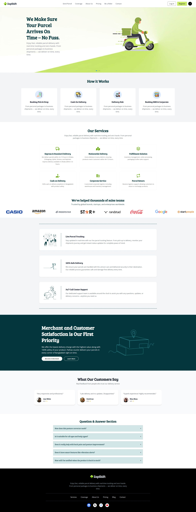

# 🚀 Zap Shift - Parcel Delivery Management System



## 🌐 Live Demo
**[Visit Zap Shift](https://zap-shift-client-zeta.vercel.app/)**

## 🔑 Demo Credentials

Want to explore all features? Use these credentials to test different user roles:

### 👤 User Account
- **Email:** (Register your own account to test user features)
- **Password:** (Create your own)

### 🏍️ Rider Account
- **Email:** sakura@gmail.com
- **Password:** sakura

### 🔐 Admin Account
- **Email:** naruto@gmail.com
- **Password:** naruto

> **Note:** You can use these demo accounts to explore rider and admin dashboards without creating new accounts.

## 📦 Repository Links
- **Client Side:** [GitHub Repository](https://github.com/ziaulhoquepatwary/zap-shift-client.git)
- **Server Side:** [GitHub Repository](https://github.com/ziaulhoquepatwary/zap-shift-server.git)

---

## 📋 Project Overview

**Zap Shift** is a comprehensive parcel delivery management system that operates through three distinct user roles - **User**, **Rider**, and **Admin**. This platform seamlessly manages the entire process from parcel booking to successful delivery with complete transparency and real-time tracking.

---

## ✨ Key Features

### 👤 User Features
- ✅ Easy registration and login system
- ✅ Comprehensive parcel booking form
- ✅ Secure online payment system (Stripe Integration)
- ✅ Real-time parcel tracking system
- ✅ Live delivery status updates
- ✅ Personalized user dashboard
- ✅ Order history and management

### 🏍️ Rider Features
- ✅ Apply to become a rider from user account
- ✅ View assigned parcels with complete details
- ✅ Parcel pickup and delivery confirmation
- ✅ Income tracking (Daily, Weekly, Monthly, Yearly)
- ✅ Delivery history and performance reports
- ✅ Cash-out system (90% of delivery charge)
- ✅ Availability status management

### 🔐 Admin Features
- ✅ Complete parcel management system
- ✅ Location-based rider assignment
- ✅ Rider application approval/rejection
- ✅ Create new admin accounts
- ✅ Comprehensive system overview
- ✅ User management and control
- ✅ Payment verification system

---

## 🛠️ Technologies Used

### Frontend
- **React.js** - UI Library
- **React Router DOM** - Routing
- **Tailwind CSS** - Styling Framework
- **DaisyUI** - Component Library
- **Axios** - HTTP Client
- **Firebase** - Authentication
- **React Leaflet** - Map Integration
- **Lucide React** - Icon Library
- **React Hook Form** - Form Management
- **React Hot Toast** - Toast Notifications
- **SweetAlert2** - Beautiful Alert Dialogs
- **Swiper** - Modern Slider/Carousel
- **Stripe** - Payment Gateway Integration

### Backend
- **Node.js** - Runtime Environment
- **Express.js** - Web Framework
- **MongoDB** - NoSQL Database
- **JWT** - JSON Web Token for Authentication

### Additional Tools
- **Leaflet** - Interactive Maps
- **Vercel** - Deployment Platform

---

## 🎯 How It Works

### 1️⃣ User Journey
1. **Registration:** User creates an account on the platform
2. **Book Parcel:** Fills out the parcel delivery form with:
   - Parcel information (weight, type, etc.)
   - Sender details
   - Receiver details and delivery location
3. **Payment:** Completes secure online payment via Stripe
4. **Wait for Rider:** Admin assigns a rider to the parcel
5. **Track Parcel:** Monitor parcel location in real-time
6. **Receive Notification:** Get updates when parcel is delivered

### 2️⃣ Rider Journey
1. **Initial Registration:** Register as a regular user first
2. **Apply as Rider:** Fill out rider application form
3. **Wait for Approval:** Admin reviews and approves the application
4. **View Assignments:** See assigned parcels with complete details
5. **Pickup Parcel:** Go to pickup location and collect the parcel
6. **Confirm Pickup:** Click "Accept Parcel" to update status
7. **Navigate to Destination:** Use provided address to reach delivery location
8. **Complete Delivery:** Click "Delivery Done" to confirm
9. **Receive Payment:** 90% of delivery charge credited to account
10. **Cash Out:** Withdraw earned money when needed

### 3️⃣ Admin Journey
1. **Monitor Payments:** View all parcels with completed payments
2. **Find Available Riders:** System shows riders based on pickup location
3. **Assign Rider:** Assign a rider who is currently available (not busy)
4. **Review Applications:** Approve or reject rider applications
5. **Manage System:** Create new admins and oversee platform operations

---

## 🚀 Getting Started

### Prerequisites
- Node.js (v14 or higher)
- MongoDB
- npm or yarn package manager
- Stripe account for payment integration
- Firebase account for authentication

### Installation

#### Client Side Setup
```bash
# Clone the repository
git clone https://github.com/ziaulhoquepatwary/zap-shift-client.git

# Navigate to project directory
cd zap-shift-client

# Install dependencies
npm install

# Create .env file and add environment variables
# VITE_FIREBASE_API_KEY=your_firebase_api_key
# VITE_STRIPE_PUBLIC_KEY=your_stripe_public_key
# VITE_API_URL=your_backend_api_url

# Start development server
npm run dev
```

#### Server Side Setup
```bash
# Clone the repository
git clone https://github.com/ziaulhoquepatwary/zap-shift-server.git

# Navigate to project directory
cd zap-shift-server

# Install dependencies
npm install

# Create .env file (see Environment Variables section below)

# Start server
npm start
```
### Environment Variables

#### Server (.env)
```env
PORT=5000
MONGODB_URI=your_mongodb_connection_string
JWT_SECRET=your_jwt_secret_key
JWT_EXPIRES_IN=7d
STRIPE_SECRET_KEY=your_stripe_secret_key
CLIENT_URL=http://localhost:5173
```

#### Client (.env)
```env
VITE_API_URL=http://localhost:5000
VITE_FIREBASE_API_KEY=your_firebase_api_key
VITE_FIREBASE_AUTH_DOMAIN=your_firebase_auth_domain
VITE_FIREBASE_PROJECT_ID=your_firebase_project_id
VITE_FIREBASE_STORAGE_BUCKET=your_firebase_storage_bucket
VITE_FIREBASE_MESSAGING_SENDER_ID=your_firebase_messaging_sender_id
VITE_FIREBASE_APP_ID=your_firebase_app_id
VITE_STRIPE_PUBLIC_KEY=your_stripe_public_key
```

---

## 📱 User Roles & Permissions

| Feature | User | Rider | Admin |
|---------|------|-------|-------|
| Book Parcel | ✅ | ✅ | ✅ |
| Track Parcel | ✅ | ✅ | ✅ |
| Apply as Rider | ✅ | - | - |
| Deliver Parcels | - | ✅ | - |
| View Income | - | ✅ | ✅ |
| Assign Riders | - | - | ✅ |
| Approve Riders | - | - | ✅ |
| Create Admin | - | - | ✅ |

---

## 🎨 Design Highlights

- **Responsive Design:** Fully responsive across all devices
- **Modern UI:** Clean and intuitive user interface
- **Real-time Updates:** Live tracking and status notifications
- **Interactive Maps:** Leaflet integration for location visualization
- **Smooth Animations:** Enhanced user experience with Swiper
- **Toast Notifications:** Real-time feedback for user actions
- **Beautiful Alerts:** SweetAlert2 for confirmations and warnings

---

## 📸 Screenshots
_Add your project screenshots here to showcase the UI/UX_

### Suggested Screenshots:
- Homepage
- User Dashboard
- Parcel Booking Form
- Payment Page
- Tracking Interface
- Rider Dashboard
- Admin Panel

---

## 🔒 Security Features

- JWT-based authentication
- Secure password hashing
- Role-based access control (RBAC)
- Protected API routes
- Secure payment processing via Stripe
- Firebase authentication integration

---

## 🌟 Future Enhancements

- [ ] Push notifications for status updates
- [ ] Multi-language support
- [ ] SMS notifications
- [ ] Rating and review system
- [ ] Advanced analytics dashboard
- [ ] Automated rider assignment algorithm
- [ ] Customer support chat system

---

## 🤝 Contributing

Contributions, issues, and feature requests are welcome! Feel free to check the [issues page](https://github.com/ziaulhoquepatwary/zap-shift-client.git).

### Steps to Contribute:
1. Fork the repository
2. Create your feature branch (`git checkout -b feature/AmazingFeature`)
3. Commit your changes (`git commit -m 'Add some AmazingFeature'`)
4. Push to the branch (`git push origin feature/AmazingFeature`)
5. Open a Pull Request

---

## 👨‍💻 Developer

**Ziaul Hoque**
- GitHub: [@ziaulhoquepatwary](https://github.com/ziaulhoquepatwary)

---

## 🙏 Acknowledgments

- Thanks to all the open-source libraries and frameworks used in this project
- Special thanks to the development community for continuous support
- Inspired by modern delivery management systems

---

## 📞 Support

For support, email ziaul.dev@gmail.com or create an issue in the repository.

---

**Made with ❤️ by Ziaul Hoque**